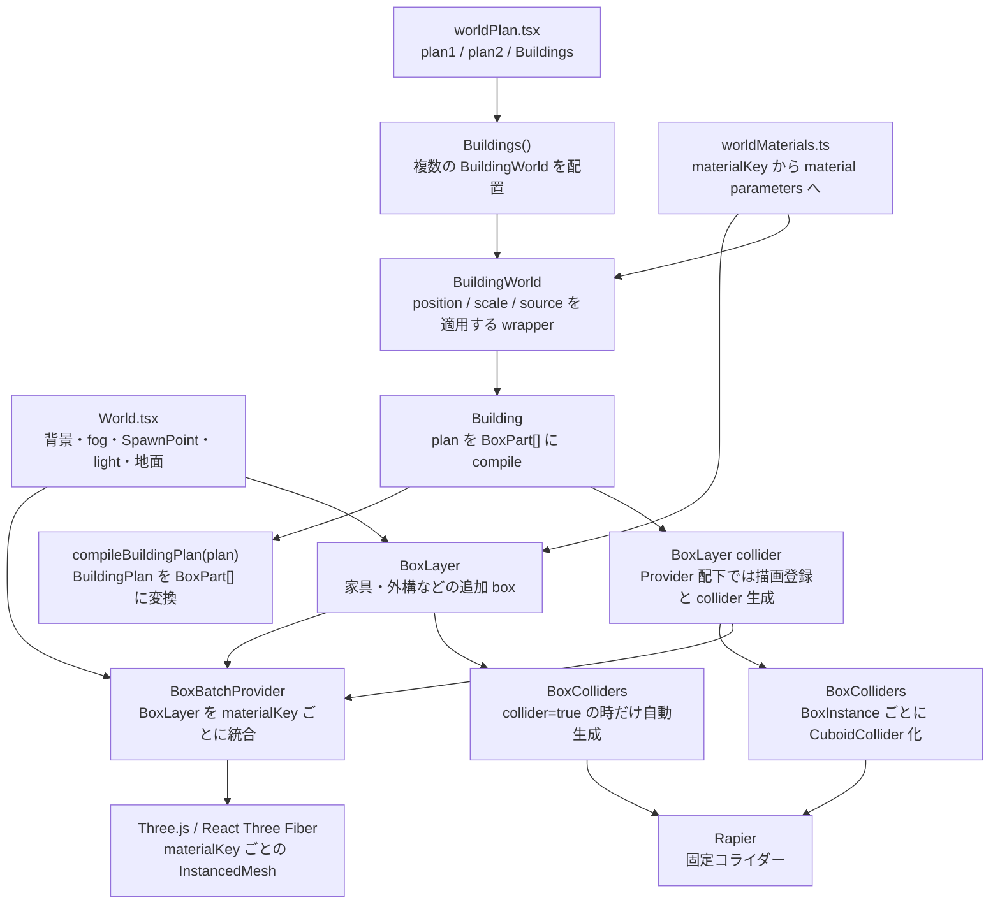

# 建物生成ワールド アーキテクチャ

このドキュメントは `xrift-building-world` の現在の実装に合わせて、建物 plan から描画・物理までの流れと、ワールド固有コードと汎用 building レイヤーの責務境界をまとめたものです。

plan の書き方はルートの `README.md` に分けています。このファイルは実装者向けの内部構造メモです。

## 全体像

このワールドは、`src/worldPlan.tsx` にある `BuildingPlan` データを `BuildingWorld` に渡し、汎用 building レイヤーで `BoxPart[]` に変換して描画と物理へ分配します。建物以外の家具・外構 box は `BoxInstance[]` として `BoxLayer` に渡せます。物理が必要な場合は `BoxLayer collider` を指定します。

現状のサンプル world は `plan1` と `plan2` の 2 つの plan を使い、`Buildings()` がそれぞれを別の高さに配置しています。`World.tsx` は背景、fog、地面、SpawnPoint、照明を持ち、`BoxBatchProvider` の中で追加の `BoxLayer` と `Buildings()` をまとめて描画します。



中心になる中間表現は `BoxInstance` と `BoxPart` です。`BoxInstance` は描画・物理共通の汎用 box で、家具や外構にも使います。`BoxPart` は `BoxInstance` に建物内の分類 `kind` を足した建物コンパイル結果です。建物 compiler が生成する床、外部地面、壁、天井、柱は基本的に axis-aligned box として表現されますが、描画と物理の経路自体は `rotation` 付き box も扱えます。

## 責務境界

- `src/World.tsx`
  - XRift ワールドとしての背景、fog、SpawnPoint、照明、地面を持ちます。
  - 建物以外のサンプル box `exteriorBoxes` を `BoxLayer collider` に渡します。
  - 描画統合のため、追加 `BoxLayer` と `Buildings()` を `BoxBatchProvider` の配下に置きます。
  - 現状の `WorldProps` は型としては `position`, `scale`, `enableProfileLog` を持ちますが、実装内ではまだ利用していません。
  - 建物 plan の実体は直接持たず、`Buildings()` を呼びます。追加 box 用に `worldBuildingMaterials` は直接参照します。
- `src/worldPlan.tsx`
  - このワールド固有の `BuildingPlan` を定義します。
  - 現状は `plan1`, `plan2`, `Buildings()` を export します。
  - `Buildings()` は `BuildingWorld` に `id`, `name`, plan、material catalog、配置、profile log 設定を渡します。
- `src/worldMaterials.ts`
  - このワールド固有の material catalog を定義します。
  - `materialKey` と Three.js `MeshStandardMaterialParameters` 相当の設定を対応させます。
  - `texture.map` は `public/` からの相対パスです。
- `src/building/`
  - 汎用 building レイヤーです。
  - plan と material catalog は呼び出し側から受け取ります。
  - `BoxBatchProvider` / `BoxLayer` / `BoxColliders` により、建物以外の box 描画・物理にも使える低レベル API を持ちます。通常は `BoxLayer collider` から `BoxColliders` を自動生成します。
  - ワールド固有の room preset、追加 box、material catalog 実体は持ちません。

## ファイル構成

```txt
xrift-building-world/
  README.md
  public/
    textures/
      warm-wood.svg
  src/
    World.tsx
    worldPlan.tsx
    worldMaterials.ts
    dev.tsx
    index.tsx
    building/
      index.ts
      Building.tsx
      BuildingWorld.tsx
      RoomObject.tsx
      BuildingColliders.tsx
      InstancedBoxLayer.tsx
      compilePlan.ts
      placement.ts
      materials.ts
      types.ts
      architecture.md
```

## データモデル

### `BuildingPlan`

`BuildingPlan` は建物全体の入力です。

- `unit?: number`
  - plan 内の寸法 1 単位を Three.js/Rapier の実座標で何単位にするかを指定します。
  - 未指定時は `1` です。
  - `compileBuildingPlan()` の入口で一度だけ実座標へスケールされ、以後の処理は world units で動きます。
- `floorHeight: number`
  - 床 slab 下端から天井 slab 上端までの建物高さです。
  - 床と天井はこの範囲内に収まります。壁と柱の位置・高さは従来通り `0..floorHeight` です。
- `wallThickness: number`
  - 壁 box の厚みです。
- `slabThickness: number`
  - 床と天井 slab の厚みです。
- `pillar?: { thickness?: number }`
  - 部屋の四隅に置く柱の X/Z 方向の太さです。
  - 未指定時は `wallThickness * 1.4` です。
- `roof?: RoofSpec | false`
  - room 形状に合わせて分割生成する平面屋根です。
  - `false` または未指定時は生成しません。
  - `overhang`, `thickness`, `heightOffset`, `materialKey`, `color`, `hidden`, `noCollider` を指定できます。
- `materialKeys`
  - デフォルト material key 群です。
  - `room.floor`, `room.wall`, `room.ceiling`, `exteriorGround`, `pillar`, `roof` を持ちます。`roof` は任意です。
- `exteriorGround?: ExteriorGroundSpec | false`
  - 部屋全体の外側に生成する地面です。
  - `false` で無効化します。
  - 未指定時はデフォルト設定で生成します。
- `rooms: RoomSpec[]`
  - 部屋の配列です。

`unit` の対象は、`floorHeight`, `wallThickness`, `slabThickness`, `pillar.thickness`, `roof.overhang`, `roof.thickness`, `roof.heightOffset`, `exteriorGround.margin`, `exteriorGround.thickness`, `room.position`, `room.size`, `room.wallThickness`, opening の `offset`, `width`, `height`, `bottom`, 床/天井/屋根開口の `position`, `size` です。door/window のデフォルト `height` と `bottom` も `unit` でスケールされます。

### `RoomSpec`

`RoomSpec` は 1 部屋の形状と開口、面ごとの上書きを表します。

- `id: string`
  - 部屋 ID です。
  - 共有壁の所有判定では `id` の辞書順を使います。辞書順で先の部屋が共有区間を所有します。
- `position: [number, number]`
  - XZ 平面上の部屋中心です。
- `size: [number, number]`
  - X 方向の幅と Z 方向の奥行きです。
- `wallThickness?: number`
  - この room の壁 box の厚みを上書きします。
  - 未指定時は `BuildingPlan.wallThickness` を使います。
- `surfaces?: RoomSurfaces`
  - 床、壁、天井、個別壁の見た目や collider を上書きします。
- `doors?: OpeningSpec[]`
  - ドア開口です。
- `windows?: OpeningSpec[]`
  - 窓開口です。
- `floorOpenings?: SlabOpeningSpec[]`
  - 床 slab に開ける矩形開口です。
- `ceilingOpenings?: SlabOpeningSpec[]`
  - 天井 slab に開ける矩形開口です。
- `roofOpenings?: SlabOpeningSpec[]`
  - 屋根 slab に開ける矩形開口です。

### `WallSide` と座標

`WallSide` は `'north' | 'south' | 'east' | 'west'` です。

- `north`: `-Z`
- `south`: `+Z`
- `east`: `+X`
- `west`: `-X`

opening の `offset` は壁ローカル座標です。

- `north` / `south` 壁では、`offset` の正方向は `+X` です。
- `east` / `west` 壁では、`offset` の正方向は north、つまり `-Z` です。

### `OpeningSpec`

`OpeningSpec` は壁に開ける矩形です。

- `side`
  - どの壁に開口を作るか。
- `offset`
  - 壁中心からの位置です。
- `width`
  - 壁に沿った開口幅です。
- `height?`
  - 開口高さです。
- `bottom?`
  - 床から開口下端までの高さです。

デフォルト値:

- door: `bottom = 0`, `height = 2.15`
- window: `bottom = 1.05`, `height = 1.05`

### `SlabOpeningSpec`

`SlabOpeningSpec` は床・天井・屋根 slab に開ける矩形です。

- `position: [number, number]`
  - 部屋中心からの `[x, z]` です。
- `size: [number, number]`
  - X 方向の幅と Z 方向の奥行きです。

床と天井の開口が部屋の外にはみ出す場合、部屋と重なる範囲だけが引かれます。屋根開口は room 基準の位置で roof union から差し引かれ、`overhang` 部分も含む屋根形状との重なりだけが抜かれます。床、天井、屋根の開口は互いに独立しており、壁開口には影響しません。

### `SurfaceSpec`

`SurfaceSpec` は面ごとの上書きです。

- `materialKey?: string`
  - material catalog の key を指定します。
- `color?: ColorRepresentation | [number, number, number]`
  - instance color を指定します。material は分けず、同じ material group 内で色だけ変えられます。
- `hidden?: boolean`
  - 描画しません。
- `noCollider?: boolean`
  - collider を作りません。

`RoomSurfaces` の `wall` は全壁のデフォルトです。`walls.north` などの個別指定は `wall` を上書きします。

`hidden: true` だけなら、見えない collider として残ります。完全に消したい場合は `hidden: true, noCollider: true` を指定します。

### インテリア配置 utility

`src/building/placement.ts` は、plan 作者が家具や照明や壁掛け object を room の床・天井・壁ローカル座標で置くための補助関数です。`compileBuildingPlan()` とは独立しており、任意の React Three Fiber object や `BoxLayer` 用の `BoxInstance` 作成に使えます。

- `getFloorPlacement(plan, { roomId, offset, height, rotationY })`
  - `offset` は部屋中心からの `[x, z]` です。
  - `height` は床 slab 上面からの高さです。
  - plan の `unit` を反映した `position` と `[0, rotationY, 0]` を返します。
- `getCeilingPlacement(plan, { roomId, offset, height, rotationY })`
  - `offset` は部屋中心からの `[x, z]` です。
  - `height` は天井 slab 下面から下方向への距離です。
  - plan の `unit` と、天井 slab の z-fighting 回避オフセット `0.001` を反映した `position` と `[0, rotationY, 0]` を返します。
- `getWallPlacement(plan, { roomId, side, offset, height, inset })`
  - `offset` は door/window と同じ壁ローカル座標です。
  - `height` は従来通り壁の下端からの高さです。
  - `inset` は壁の室内面から部屋内側へずらす距離です。
  - 返す `rotation` は object の local `+Z` が部屋内側を向く向きです。
- `getRoomFloorFrame()` / `getRoomCeilingFrame()` / `getRoomWallFrame()`
  - 配置可能範囲、壁の接線、室内向き法線など、より低レベルな frame 情報を返します。
- `getBuildingInfo(plan)`
  - `plan.unit` を反映した建物全体の `center` / `size` / `minX` / `maxX` / `minZ` / `maxZ`、`floorHeight`、`wallThickness`、`slabThickness`、`floorTopY`、`ceilingY`、`ceilingBottomY`、およびスケール済み `rooms` を返します。
- `getRoomInfo(plan, roomId)`
  - 指定 room の `position` / `size` / `width` / `depth` / `wallThickness` / `center`、境界、`floorFrame`、`ceilingFrame`、4 方向の `walls` frame を返します。
- `RoomObject` / `CeilingObject` / `WallObject`
  - `BuildingWorld` 内で children を直接 `<group>` で囲み、上記 utility の結果を `position` / `rotation` に適用します。
  - plan は `BuildingWorld` が `BuildingPlacementProvider` で context として渡します。
  - `RoomObject.position` と `CeilingObject.position` は部屋中心からの `[x, z]`、`WallObject.offset` は door/window と同じ壁ローカル offset です。
- `useFloorPlacement()` / `useCeilingPlacement()` / `useWallPlacement()`
  - `BuildingWorld` 内の任意 component から context の plan を使って transform だけを取得します。
  - `BuildingWorld.id` から plan を検索する global registry は持ちません。複数階や複数棟で同じ room id があっても、React ツリー上の親 `BuildingWorld` が配置対象を決めます。
- `useBuildingInfo()` / `useRoomInfo(roomId)`
  - `BuildingWorld` 内の任意 component から、親 `BuildingWorld` の plan に基づく建物情報や指定 room 情報を取得します。
  - 返す寸法や境界は placement utility と同じ BuildingWorld ローカル座標です。
- `useRoomObjectContext()` / `useWallObjectContext()`
  - `RoomObject` / `WallObject` の children から、親 wrapper の `roomId` や `side` を取得します。
  - wrapper 外で呼んだ場合は `undefined` を返すため、家具 component 側で明示 props と親 context の fallback を組み合わせられます。

### `BoxInstance` と `BoxPart`

`BoxInstance` は汎用 box 描画・物理用の中間表現です。家具、外構、建物以外のパーツも同じ形で `BoxLayer` に渡せます。

- `id`
- `position`
- `size`
- `rotation?`
- `materialKey`
- `color?`
- `source?`
- `visible?`
- `collider?`

`source` は統合描画後も元の `BuildingWorld` / `BoxLayer` を追跡するための情報です。`source.kind` は `buildingWorld` または `boxLayer` です。

`BoxPart` は建物コンパイル後の中間表現で、`BoxInstance` に `kind` を足した型です。`kind` は `floor`, `exteriorGround`, `wall`, `ceiling`, `roof`, `pillar`, `trim`, `colliderOnly` を取ります。

現状の compiler は回転なしの box を主に生成しますが、描画と collider の経路は `rotation` を受け取れる形になっています。

## コンパイル処理

### 1. unit スケール

`compileBuildingPlan(plan)` は最初に `scalePlanToWorldUnits(plan)` を呼びます。

`unit === 1` の場合は元の plan をそのまま使います。`unit` が 1 以外なら、寸法値を実座標へ変換し、変換後 plan の `unit` は `1` になります。

### 2. 外部地面

`compileExteriorGround(plan)` は、全 room の外接矩形から 1 枚の `exteriorGround` box を生成します。

- `plan.exteriorGround === false` または room が空の場合は生成しません。
- `margin` のデフォルトは `14` です。
- `thickness` のデフォルトは `plan.slabThickness` です。
- material key は `exteriorGround.materialKey ?? plan.materialKeys.exteriorGround` です。
- 室内床との z-fighting を避けるため、Y 方向に `0.002` 下げています。

### 3. 部屋

`compileRoom(plan, room)` は 1 部屋から床、天井、4 面の壁、4 隅の柱を生成します。

床、壁、天井は `plan.materialKeys.room` をデフォルトにし、`room.surfaces` で上書きします。

床 slab は `0..plan.slabThickness`、天井 slab は壁との z-fighting を避けるために `0.001` 下げて `plan.floorHeight - plan.slabThickness - 0.001..plan.floorHeight - 0.001` に収まります。`floorOpenings` / `ceilingOpenings` がある場合は、部屋矩形から開口矩形を引いた非重複矩形群に分割して box 化します。壁と柱は従来通り `0..plan.floorHeight` に生成します。

壁は各 side ごとに `compileWall()` へ渡されます。ドア、窓、共有壁の重複除去は、すべて壁ローカルの矩形開口として扱います。

### 4. 共有壁

隣接する部屋が同じ境界面を共有する場合、同じ壁 mesh / collider が二重生成されないようにします。

現在の実装では壁全体を単純に skip しません。部屋サイズが違う場合に非共有区間まで消えないよう、辞書順で先の room が共有区間を所有し、後の room ではその共有区間だけを全高の開口として差し引きます。

共有判定は `getOppositeWallOverlap()` で room の境界と重なり範囲を調べます。境界比較には `EPSILON = 0.001` を使います。

### 5. 壁と開口

壁は、まず壁ローカル 2D 空間の 1 枚の矩形として扱います。

`splitWallSegments()` は、その矩形から opening を順に引きます。1 つの矩形開口を引くと、最大で 4 つの壁矩形が残ります。ドアと窓は縦方向優先で上下を連続した box として残し、共有壁開口は従来通り横方向優先で左右を連続した box として残します。

残った矩形は `compileWall()` で world-space の box に戻されます。north/south 壁は X 方向に長く、east/west 壁は Z 方向に長い box になります。

### 6. 屋根

`compileRoof()` は `plan.roof` が指定された場合に、room 矩形の合成範囲を覆う `roof` box 群を生成します。最大外接矩形ではなく、room 形状に沿った非重複の矩形群へ分割します。

- `overhang` のデフォルトは `0` です。
- `thickness` のデフォルトは `plan.slabThickness` です。
- `heightOffset` のデフォルトは `0` です。正の値で上、負の値で下に移動します。
- Y 位置は `plan.floorHeight + heightOffset` です。`heightOffset = 0` では屋根 slab の中心が建物高さの上端に乗り、厚みの半分が上へはみ出します。
- 各 room の `roofOpenings` がある場合は、room 中心基準の開口矩形を roof union から引いた非重複矩形群に分割して box 化します。
- material key は `roof.materialKey ?? plan.materialKeys.roof ?? plan.materialKeys.room.ceiling` です。

### 7. 柱

`compileRoomTrim()` は部屋の 4 隅に `pillar` box を生成します。

- 高さは z-fighting を避けるため、上端だけ `0.001` はみ出す `plan.floorHeight + 0.001` です。
- 太さは `plan.pillar?.thickness ?? plan.wallThickness * 1.4` です。
- material key は `plan.materialKeys.pillar` です。

隣接 room から完全一致する柱が生成された場合は、最後の dedupe で除去されます。

### 8. 重複除去

`dedupeExactBoxParts(parts)` は完全一致する `BoxPart` だけを除去します。

これは幾何的な最適化や壁結合ではありません。kind、materialKey、color、visible/collider、position、size、rotation が一致する box だけを重複として消します。

## 描画

`Building` は `compileBuildingPlan(plan)` の結果を `BoxLayer` に渡します。

`BoxLayer` は `visible !== false` の `BoxInstance` だけを対象にし、`materialKey` ごとにグループ化して `InstancedMesh` を作ります。`InstancedBoxLayer` は互換用 alias です。

通常は `BoxLayer` ごとに描画されます。上位に `BoxBatchProvider` がある場合、配下の `BoxLayer` は mesh を直接作らず、`BoxInstance[]`、material catalog、`id` / `label` から作った `source`、親 `group` の world transform を provider に登録します。`BoxBatchProvider` は登録された box を world-space に変換してから統合し、material key ごとに 1 つの `InstancedMesh` を作ります。登録内容は `parts`, `materials`, `source`, `matrixWorld` が変わった時だけ更新されます。

`BuildingWorld` は `source.kind = 'buildingWorld'` を `Building` に渡し、`Building` は各 `BoxPart.source` にそれを付与してから `BoxLayer` へ渡します。直接置いた `BoxLayer` は `kind` が常に `boxLayer` で、`id` / `label` props だけを受け取ります。統合後の `InstancedMesh.userData.boxInstances[instanceId]` から、元の `BoxInstance.id`、`materialKey`、`source` を参照できます。

material catalog に texture がある場合は `useXRift().baseUrl` と `texture.map` を結合して `useTexture()` で読み込みます。`texture.map` が `http:`, `https:`, `data:`, `blob:` から始まる場合はそのまま使います。`texture.tileSize` を指定した material は、shader で `instanceSize` から面ごとの world-unit UV を作るため、box のサイズが変わっても texture の密度が一定になります。`tileSize` を省略した material は従来通り unit box の UV と `texture.repeat` で貼られます。

各 instance には以下を設定します。

- matrix: `position`, `rotation`, `size`
- instance size: texture の `tileSize` 指定時に shader が world-unit UV を作るための `size`
- instance color: `BoxInstance.color ?? material.color ?? '#ffffff'`

material 自体の `color` は白にし、`vertexColors: true` と `instanceColor` で表面色を出します。これにより、同じ material key なら色違いでも 1 つの instanced mesh にまとめられます。

## 物理

`Building` は同じ `BoxPart[]` を `BoxLayer collider` に渡します。これにより描画登録と collider 生成の基準 group が揃います。

`BoxColliders` は `RigidBody type="fixed"` の中に `CuboidCollider` を並べます。対象は `collider !== false` の `BoxInstance` だけです。`BuildingColliders` は互換用 alias です。`BoxBatchProvider` は描画だけを統合し、collider は統合しません。

`CuboidCollider.args` は Rapier の half extents なので、`part.size / 2` を渡しています。`position` と `rotation` は `BoxInstance` / `BoxPart` からそのまま渡します。

親 `group` の `position` / `rotation` が reactive に変わる場合、Three.js の親 transform は Rapier の fixed body に自動反映されないことがあります。そのため `BoxColliders` は自身の wrapper group の `matrixWorld` を監視し、変化した時だけ `RigidBody.setTranslation()` / `setRotation()` で physics body を同期します。

## プロファイル出力

`Building.tsx` は `enableProfileLog` が true の場合、コンパイル後に以下の集計を console に出します。

```ts
console.log('[building profile]', source, {
  renderInstances,
  colliderInstances,
  materialCount,
  kindCount,
  byMaterial,
  byKind,
})
```

`BuildingWorld` の `enableProfileLog` デフォルトは true です。サンプルの `Buildings()` でも true を渡しています。

## 公開 API

`src/index.tsx` は以下を export します。

- `World`, `WorldProps`

building API は package root からは export しません。`World.tsx` 内や補完用 world で使う場合は、必要な component / utility を `src/building/index.ts` 経由で import します。

現状、`plan1`, `plan2`, `Buildings()` は `src/worldPlan.tsx` からは export されていますが、package の `src/index.tsx` からは export されていません。

## 拡張方針

建物自体の拡張は、まず `BuildingPlan` の入力表現を増やし、最終的に `BoxPart[]` に落とす形を保つのがよいです。家具やエクステリアのように建物 plan に入れないものは、`BoxInstance[]` と共通 material catalog を `BoxLayer` に渡します。物理が必要な layer だけ `collider` prop を有効にします。

候補:

- 廊下 preset
- 複数階を `BuildingPlan` の構造に含める
- 階段
- 外壁専用 material key
- ドア枠・窓枠の trim
- collider 結合最適化
- GUI で編集した floor plan から `BuildingPlan` を生成

重要なのは、ワールド固有の plan/material catalog と、汎用 building 生成レイヤーを分離し続けることです。
